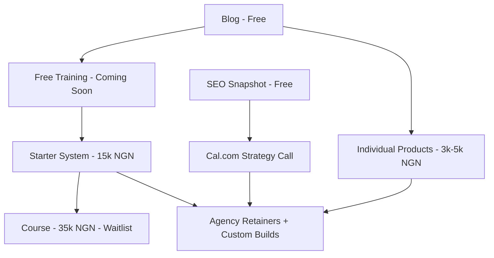
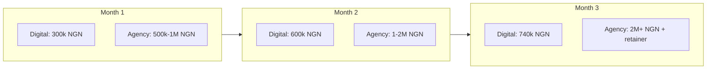

# Triumphant HQ Monetization Plan

## What you already have (your unfair advantage)

You are not starting from zero. [triumphanthq.com](https://www.triumphanthq.com/) already runs a **working revenue stack**:

| Asset | Status | Price range |
|-------|--------|-------------|
| 12 Digital Forge products + Starter System | Live checkout (Flutterwave + Lemon Squeezy) | ₦3k–₦15k / $4–$20 |
| Parent Home Routine bundle | Live via Selar | ₦3k |
| SEO Snapshot lead funnel | Live → Cal.com booking | Free → agency upsell |
| 14 blog posts | Live, linked to products | Top-of-funnel |
| Agency services (web, SEO, apps, AI) | Live, contact/WhatsApp only | High-ticket (you set price) |
| Digital Forge Course | Waitlist only | ₦35k / ~$23 |
| 1 published funnel | Live (WhatsApp checkout, not integrated) | ₦15k |

Your coded offer ladder in [`app/digital-forge/page.tsx`](app/digital-forge/page.tsx) is already correct:

**The problem is not missing products — it is missing traffic, nurture, trust, and upsell paths.** Money is leaking at every handoff.

---

## Revenue model: hybrid (your choice)

**Front door (scalable, low friction):** Digital products + SEO audit → build a list and cash flow  
**Back door (wealth-building):** Agency retainers + custom apps → ₦500k–₦5M+ projects

Target split for first 90 days:
- **30%** from digital product sales (volume, proof, list growth)
- **70%** from agency/services (where real wealth is built)

---

## Phase 0: Fix revenue leaks (Week 1) — do this before any marketing spend

These are blocking money **right now**:

1. **Fix missing delivery link** — `the-weekend-roi-engine` product has no Google Drive link in [`content/digital-forge/generated/`](content/digital-forge/generated/). Buyers who pay cannot get the product → refunds + bad reviews.

2. **Unify WhatsApp numbers** — Widget uses UK `447478036301`, contact/funnels use Nigeria `2348107711190` ([`components/WhatsAppWidget.tsx`](components/WhatsAppWidget.tsx) vs [`app/contact/page.tsx`](app/contact/page.tsx)). Pick one sales number, one support number, display both consistently.

3. **Wire Lemon Squeezy for all 12 products** — International buyers can only checkout if each offer key exists in `DIGITAL_FORGE_LS_VARIANT_MAP_JSON`. Without this, you lose every non-Nigeria sale.

4. **Publish or fix broken product** — Blog links to `beyond-listening` product but funnel is `draft` and product JSON is missing. Either publish it or remove blog links.

5. **Route contact form to Airtable** — [`app/contact/page.tsx`](app/contact/page.tsx) sends EmailJS only. Every inquiry that does not get a same-day reply is lost revenue. Mirror the pattern in [`app/api/digital-forge/funnel-optin/route.ts`](app/api/digital-forge/funnel-optin/route.ts).

6. **Automate SEO nurture** — Your 5-email SEO sequence exists in the external Python backend but is **not scheduled** (per [`TRIUMPHANTHQ_IMPLEMENTATION_WORKFLOW.md`](TRIUMPHANTHQ_IMPLEMENTATION_WORKFLOW.md)). Leads go cold within 48 hours without follow-up.

---

## Phase 1: Activate cash flow (Weeks 2–4)

### A. Digital Forge — turn catalog into a machine

**Daily action (no code needed):**
- Post 1 blog excerpt + product link to WhatsApp Status, LinkedIn, X, and 2 Nigeria Facebook groups
- Reply to every SEO audit lead within 2 hours via WhatsApp

**Weekly action:**
- Run one funnel email blast from [`app/digital-forge/builder`](app/digital-forge/builder) to existing Airtable leads

**Code changes (high ROI):**
- **Launch the course** — Curriculum is ready; only waitlist exists at [`app/digital-forge/course/page.tsx`](app/digital-forge/course/page.tsx). Add checkout using existing `resolveSystemOffer()` pattern in [`lib/digital-forge-offers.ts`](lib/digital-forge-offers.ts). This unlocks ₦35k per buyer with zero new product creation.
- **Replace funnel WhatsApp checkout with integrated checkout** — [`content/digital-forge/funnels/ai-side-hustle-starter-nigeria.json`](content/digital-forge/funnels/ai-side-hustle-starter-nigeria.json) sends buyers to `wa.me` instead of `/digital-forge/checkout?offer=system`. You lose automated delivery and payment tracking on every sale.
- **Add post-purchase upsell** on [`app/digital-forge/checkout/confirmed/page.tsx`](app/digital-forge/checkout/confirmed/page.tsx): "Book a free 30-min strategy call" (Cal.com) or "Need us to build this for you?" (contact). This is your hybrid bridge.

**Realistic digital revenue (conservative, 90 days):**
- 5 Starter System sales/week × ₦15,000 = **₦300,000/month**
- 10 individual products/week × ₦4,000 avg = **₦160,000/month**
- 2 course enrollments/week × ₦35,000 = **₦280,000/month** (after launch)
- **Total digital: ~₦740,000/month (~$480)** — not life-changing alone, but funds ads and builds your buyer list

### B. SEO Snapshot — your highest-value lead engine

Flow: [`app/seo-snapshot`](app/seo-snapshot) → results → full audit request → Cal.com → paid SEO engagement

**Pricing to quote on calls (suggested):**
| Service | Nigeria | International |
|---------|---------|---------------|
| SEO audit + 90-day roadmap | ₦150,000–₦300,000 | $500–$1,500 |
| Monthly SEO retainer | ₦100,000–₦250,000/mo | $300–$800/mo |
| Full website + SEO package | ₦500,000–₦2,000,000 | $2,000–$8,000 |

**Goal:** 4 Cal.com calls/week → 1 retainer/month = **₦100k–₦250k recurring**

### C. Agency services — where you stop being poor

Your [`app/services/page.tsx`](app/services/page.tsx) describes elite services but has no pricing anchors. Add **starting-from prices** and a **"Book Discovery Call"** button (not just contact form). Buyers need a number before they reach out.

**Highest-ticket offers to push actively:**
1. Custom Next.js/React web apps — ₦1M–₦5M per project
2. AI workflow automation (Zapier/Make + custom APIs) — ₦300k–₦1.5M
3. Monthly SEO retainers — recurring
4. Funnel engineering for other businesses — ₦500k+

**One client project per month at ₦1M+ changes your financial reality.** Digital products exist to feed this pipeline.

---

## Phase 2: Build trust and automate nurture (Month 2)

### Social proof (critical gap)

[`app/digital-forge/system/page.tsx`](app/digital-forge/system/page.tsx) literally says "Before there are testimonials…" — this kills conversion on ₦15k+ products.

**Actions:**
- Collect 3 video testimonials from anyone who used your templates (even free users)
- Add a `Testimonials` section component to homepage, system page, and services page
- Add `aggregateRating` schema to product pages in [`app/digital-forge/products/[slug]/page.tsx`](app/digital-forge/products/[slug]/page.tsx)

### Email nurture (replace EmailJS-only with real sequences)

Current: transactional emails only via EmailJS  
Needed: lifecycle campaigns

| Trigger | Sequence | Goal |
|---------|----------|------|
| SEO audit opt-in | 5 emails over 14 days (already built, needs cron) | Book Cal.com call |
| Product purchase | Day 1 delivery → Day 3 "how's it going?" → Day 7 agency upsell | Retainer lead |
| Course waitlist | Launch announcement + early-bird discount | Course revenue |
| Funnel opt-in | 3 emails → offer page with integrated checkout | Starter System sale |

Implement via: Airtable automations + EmailJS (short term) or migrate to Brevo/ConvertKit (medium term).

### Analytics (you are flying blind)

Add GA4 + PostHog custom events for:
- `seo_audit_submitted`
- `checkout_initiated`
- `purchase_completed`
- `cal_booking_clicked`
- `whatsapp_clicked`

Files to update: [`app/providers.tsx`](app/providers.tsx), [`app/layout.tsx`](app/layout.tsx), SEO results page, checkout client.

---

## Phase 3: Recurring revenue and scale (Month 3+)

### Subscriptions (not built yet — highest leverage code project)

Your services page mentions "monthly done-for-you keyword growth plans" but there is **no recurring billing** in the codebase. Options:

1. **Quick:** Sell retainers via Flutterwave recurring / Lemon Squeezy subscriptions manually invoiced monthly
2. **Proper:** Add Lemon Squeezy subscription products for SEO Starter (₦50k/mo) and SEO Growth (₦150k/mo) tiers

This is the difference between **one-time poverty cycles** and **predictable monthly income**.

### Productize agency work

Package what you already do into fixed-scope offers on the site:

| Productized service | Price | Delivery |
|--------------------|-------|----------|
| "Launch Site in 7 Days" | ₦350k / $1,200 | Fixed template + customization |
| "SEO Foundation Sprint" | ₦200k / $700 | 30-day audit + implementation |
| "AI Workflow Setup" | ₦150k / $500 | 3 automations + training |

Add dedicated landing pages (like [`app/parent-home-routine/page.tsx`](app/parent-home-routine/page.tsx)) with checkout or deposit via existing Flutterwave integration.

### Distribution automation

Your builder tracks distribution to Telegram, LinkedIn, Facebook, Instagram, X as `pending` in [`app/digital-forge/builder/ApprovalQueueDashboard.tsx`](app/digital-forge/builder/ApprovalQueueDashboard.tsx). Wire Zapier/Make to auto-post when a product is published — this is the "autonomous pipeline" you sell to clients; use it on yourself first.

---

## 90-day revenue targets (realistic hybrid)

| Stream | Month 1 | Month 3 | Notes |
|--------|---------|---------|-------|
| Digital products | ₦200–400k | ₦600–800k | Needs traffic + course launch |
| Agency projects | ₦500k–1M | ₦2M+ | 1–2 projects closes the gap |
| SEO retainers | ₦0 | ₦100–250k/mo | Starts after Cal.com conversions |
| Local services | ₦50–100k | ₦50–100k | Cash flow, not wealth |

**"Never poor again" threshold:** ~₦1.5M/month (~$1,000) net with at least ₦300k recurring. That is **1 agency client + 2 retainers + steady digital sales** — all reachable with what you have built.

---

## What NOT to do (common traps)

- **Do not build new products before selling existing ones.** You have 12 published products and a course ready to launch.
- **Do not chase global before fixing Lemon Squeezy variant map.** International checkout is half-wired.
- **Do not rely on WhatsApp-only sales.** You lose delivery automation, order tracking, and Meta Pixel `Purchase` events.
- **Do not skip testimonials.** Without social proof, paid traffic will not convert.
- **Do not add Stripe/PayPal yet.** Flutterwave + Lemon Squeezy cover Nigeria + international for now.

---

## Recommended execution order

| Priority | Task | Type | Impact |
|----------|------|------|--------|
| 1 | Fix delivery gap + WhatsApp numbers | Ops | Stop losing buyers |
| 2 | Contact form → Airtable | Code | Stop losing leads |
| 3 | Launch course checkout | Code | +₦35k/sale immediately |
| 4 | Post-purchase + SEO upsell CTAs | Code | Hybrid funnel bridge |
| 5 | Funnel → integrated checkout | Code | Trackable sales |
| 6 | SEO nurture cron | Ops/Code | Warm leads automatically |
| 7 | 3 testimonials + homepage section | Marketing | Conversion lift |
| 8 | GA4 + PostHog events | Code | Know what works |
| 9 | Service pricing anchors on site | Content | Qualify agency leads |
| 10 | Lemon Squeezy variant map for all products | Config | Unlock global sales |

---

## The honest answer to "how do I never be poor again"

**Wealth comes from agency + retainers, not ₦3k PDFs.** Your site is already a legitimate business platform — but it is optimized for *building* revenue infrastructure, not yet for *closing* high-ticket deals at scale.

Your daily money formula:
1. **Publish** — 1 piece of content/day (blog, WhatsApp, LinkedIn) linking to Starter System or SEO audit
2. **Follow up** — every lead within 2 hours on WhatsApp
3. **Upsell** — every product buyer gets offered a strategy call
4. **Close** — pitch one retainer or project per week on Cal.com calls
5. **Retain** — monthly SEO/client check-ins = recurring income

The code fixes above remove friction. The sales discipline above builds wealth. You have the assets — the gap is activation and follow-through.
